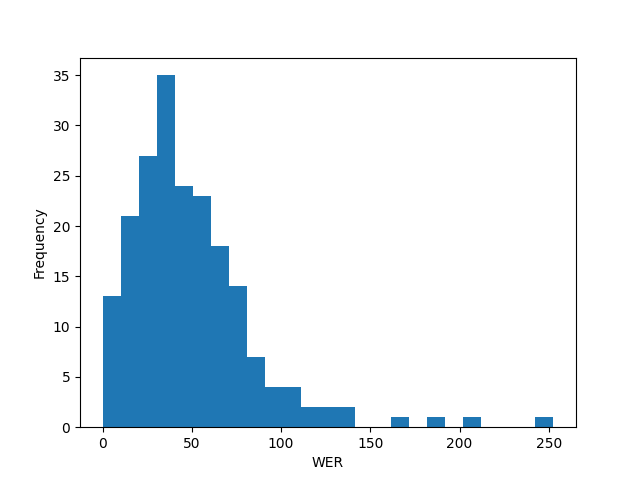

## Maxmatch performance
___

Below is a histogram of the sentences' WER.

The maxmatch program gave a result of an average WER of 49.62%, with the median WER being 42.59%. The closest WER rate to the mean by any individual sentence is 50%, achieved by 4 sentences. Here is one of these sentences to display an expected result of the program:

WER: 50.00%\
REF: 衣服 上 的 血跡   與 謀殺案 案發       當天 報導 上 的 描述 一樣 。\
HYP: 衣服 上 的 血  跡 與 謀   殺  案 案 發 當天 報導 上 的 描述 一樣 。\
EVA:        S  I   S   S  I I I 

We can see that the primary problem is the lack of words in the dictionary to match to, with many words being separated out into single characters, such as with 謀 殺 案 versus 謀殺案. Punctuation and dictionary findings are properly dealt with. Through the 200 sentences, only 6 times did two unrelated words get tokenized together, all of which involve at least one of the words having just one symbol. Here is such an example:

WER: 105.00%\
REF: 和 許多 社會 主義 者   一樣 ， Pedro Sánchez                     在 Évole         項目 中 表示 西班牙 是 萬民   之 邦 。\
HYP: 和 許多 社會    主義者 一樣 ， P     e       d r o S á n c h e z 在 É     v o l e 項目 中 表示 西班牙 是 萬  民 之 邦 。\
EVA:         D  S        S     S       I I I I I I I I I I   S     I I I I               S  I 

We can see that 主義者 was formed when the final 者 symbol is meant to be a separate token. However, this sentence also displays a larger issue that accounts for much of the WER through the data. The Latin character names tested on are not present within the training dictionaries, so each character within these names gets spaced out and causes large strings of errors within the tokenizing process, massively increasing the Levenshtein distance. Here is the highest WER sentence, and the one with the seemingly most egregious case of name spacing:

WER: 252.63%\
REF: Goffredo Petrassi                           的 兩 個 學生 、 Ennio Morricone                         以及 Bruno Nicolai                     在 聖塞西莉亞         音樂 學校 見面   了 。\
HYP: G        of       f r e d o P e t r a s s i 的 兩 個 學生 、 E     n         n i o M o r r i c o n e 以及 B     r       u n o N i c o l a i 在 聖     塞 西 莉 亞 音樂 學校 見  面 了 。\
EVA: S        S        I I I I I I I I I I I I I            S     S         I I I I I I I I I I I I    S     S       I I I I I I I I I I   S     I I I I       S  I

Without the names, this sentence would not perform phenomenally, mainly due to the string 聖塞西莉亞 not being recognized, but it would be much better. There were 9 cases of perfectly tokenized sentences, but none exist between 0.00% and 8.70%. Here is the longest of these perfect tokenizations:

WER: 0.00%\
REF: 就 像 大 多數 南 歐 的 地點 一樣 ， 該 研究 可 追溯 到 早 至 公元 前 5 世紀 。\
HYP: 就 像 大 多數 南 歐 的 地點 一樣 ， 該 研究 可 追溯 到 早 至 公元 前 5 世紀 。\
EVA:

All tokens are either 1 or 2 characters. Of our 9 0.00% WER sentences, 6 contain only these short tokens, with the other 3 maxing out at 3 characters per token. Here is the 8.70% WER sentence, containing just one missed word, and the same 1 to 2 characters per token characteristic:

WER: 8.70%\
REF: 他 也 表示 ， “ 這樣 一 份 文件   的 存在 可能 會 帶來 讓 人 難 以 接受 的 後果 。 ”\
HYP: 他 也 表示 ， “ 這樣 一 份 文  件 的 存在 可能 會 帶來 讓 人 難 以 接受 的 後果 。 ”\
EVA:                   S  I

Overall, the performance of maxmatch leaves much to be desired towards improving tokenization efficacy with a limited dictionary. However, with more dictionary words added, the higher likelihood of the opposite error primarily seen in these results, of meshing characters that have no business being together. But considering the simplicity of the algorithm, and the potential for significant improvement when tested on data without Latin character names, or if Latin alphabet characters are simply left alone in the tokenizing process, it is somewhat satisfactory.